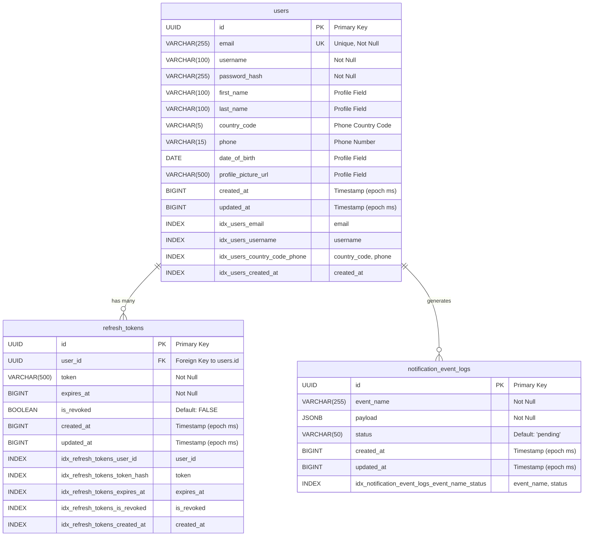

# User Service Database ER Diagram

This document contains the Entity-Relationship diagram for the User Service database schema.

## Database Schema Overview

The User Service database consists of three main tables:
- **users**: Core user authentication and profile information
- **refresh_tokens**: Session management and token storage
- **notification_event_logs**: Event logging for notifications

## ER Diagram

## Table Descriptions

### users
The main user table containing authentication and profile information.

**Key Features:**
- UUID primary key with auto-generation
- Unique email constraint
- Password hash storage
- Profile fields (first_name, last_name, country_code, phone, date_of_birth, profile_picture_url)
- Automatic timestamp management (created_at, updated_at)
- Multiple indexes for performance optimization

### refresh_tokens
Manages user session tokens for authentication.

**Key Features:**
- UUID primary key with auto-generation
- Foreign key relationship to users table with CASCADE delete
- Token expiration management
- Revocation tracking
- Automatic timestamp management
- Comprehensive indexing for performance

### notification_event_logs
Stores notification events for processing and tracking.

**Key Features:**
- UUID primary key
- JSONB payload for flexible event data storage
- Status tracking for event processing
- Automatic timestamp management
- Composite index on event_name and status

## Database Features

### Triggers
- **update_updated_at_column()**: Automatically updates the `updated_at` timestamp on any table update

### Indexes
- **Performance Indexes**: Optimized for common query patterns
- **Composite Indexes**: Multi-column indexes for complex queries
- **Unique Constraints**: Ensures data integrity

### Data Types
- **UUID**: Primary keys for scalability and security
- **BIGINT**: Timestamps stored as epoch milliseconds
- **JSONB**: Flexible JSON storage for event payloads
- **VARCHAR**: String fields with appropriate length limits

## Relationships

1. **users → refresh_tokens**: One-to-many relationship
   - A user can have multiple refresh tokens
   - Tokens are automatically deleted when user is deleted (CASCADE)

2. **users → notification_event_logs**: One-to-many relationship
   - Users can generate multiple notification events
   - Events are tracked for audit and processing purposes

## Migration History

- **000001**: Initial schema creation
- **1754804014**: Added user profile fields (first_name, last_name, phone, date_of_birth, profile_picture_url)

## Usage Notes

- All timestamps are stored as BIGINT (epoch milliseconds) for consistency
- UUIDs are used for all primary keys to ensure scalability
- Foreign key relationships maintain referential integrity
- Automatic triggers ensure data consistency
- Comprehensive indexing optimizes query performance
